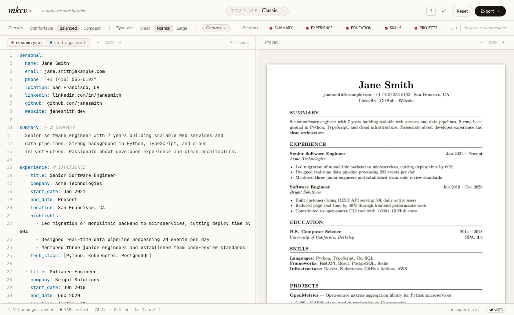

# mkcv

영문 가이드: [README.md](./README.md)

YAML 하나로 이력서를 작성하고, 실시간 PDF 미리보기와 함께 Markdown, LaTeX, PDF로 내보낼 수 있는 웹 앱입니다.



---

## mkcv란?

왼쪽 에디터에 YAML 형식으로 이력서를 작성하면 오른쪽에 PDF가 실시간으로 렌더링됩니다. 작성이 끝나면 PDF, Markdown, LaTeX 중 원하는 형식으로 내보낼 수 있습니다.

- 영어/한국어 혼합 이력서 PDF 지원 (XeLaTeX 기반)
- 템플릿 15종 — 취업용·학술용·디자인 직군 등 목적별 선택 가능
- 데이터는 브라우저 localStorage에 저장 — 계정 없음, 서버에 데이터 전송 없음

---

## 빠른 시작

### 1. 바로 써보기 (설치 불필요)

Hugging Face Space에서 바로 사용할 수 있습니다:

**[https://huggingface.co/spaces/Hyun9junn/mkcv](https://huggingface.co/spaces/Hyun9junn/mkcv)**

### 2. Docker로 로컬 실행

> Docker가 없다면 [Docker Desktop](https://www.docker.com/products/docker-desktop)을 먼저 설치하세요.

```bash
docker pull ghcr.io/hyun9junn/mkcv:latest
docker run --rm -p 8000:8000 ghcr.io/hyun9junn/mkcv:latest
```

브라우저에서 **http://localhost:8000**을 열면 됩니다.

---

## 주요 기능

| 기능 | 설명 |
|------|------|
| **실시간 PDF 미리보기** | 타이핑을 멈추고 1.5초 후 PDF가 자동 갱신됩니다 |
| **15종 LaTeX 템플릿** | 클래식, ATS 최적화, 금융, 크리에이티브, 기술직군 등 |
| **영어/한국어 혼합 PDF** | XeLaTeX과 템플릿별 한글 폰트 스택으로 완벽 렌더링 |
| **줌 컨트롤** | +/− 버튼, 백분율 클릭으로 100% 리셋, `Ctrl`/`⌘` + 스크롤 |
| **섹션 패널** | 칩을 드래그해 섹션 순서 변경, 가시성 토글, 초기화 |
| **레이아웃 조절** | Density(편안함/균형/조밀)와 Font Scale(소/중/대) |
| **연락처 필드 토글** | PDF 헤더에 표시할 항목을 YAML 수정 없이 선택 |
| **3가지 내보내기 형식** | PDF, Markdown, LaTeX |
| **YAML 백업 & 복원** | 이력서와 설정을 압축 파일로 내보내고, 다른 기기에서 복원 |
| **자동 저장** | 입력할 때마다 브라우저에 자동 저장 |
| **인라인 YAML 검증** | 잘못된 필드를 즉시 표시, 자동완성 힌트 제공 |
| **커스텀 섹션** | 기본 섹션 외에 자유 형식 섹션 추가 가능 |
| **다크 / 라이트 모드** | 세션 간 유지 |

---

## 사용 방법

### 이력서 작성

왼쪽 에디터에 YAML 형식으로 이력서 내용을 입력합니다.

- 입력하는 즉시 자동 저장됩니다 (Save 버튼 없음)
- 잘못된 필드는 인라인으로 오류가 표시됩니다
- 필드명 입력 시 자동완성 힌트가 나타납니다

### PDF 미리보기

오른쪽 창에 PDF가 실시간으로 표시됩니다.

- **줌:** `+` / `−` 버튼, 백분율 클릭으로 100% 리셋, 또는 `Ctrl`/`⌘` + 스크롤
- 타이핑을 멈추고 1.5초 후 자동 갱신됩니다

### 섹션 패널

툴바 아래 칩 목록에서 섹션을 관리합니다.

| 동작 | 방법 |
|------|------|
| 섹션 표시 / 숨기기 | 칩 클릭 — YAML 수정 없이 PDF에서만 숨깁니다 |
| 섹션 순서 변경 | 칩을 좌우로 드래그 |
| 섹션 초기화 | 칩의 ↺ 클릭 → 확인 → 5초 내에 실행 취소 가능 |
| 회색 칩 | YAML에 아직 없는 섹션 — 드래그해서 위치를 미리 지정 |

### 템플릿

툴바의 드롭다운에서 템플릿을 선택합니다. 각 템플릿은 레이아웃, 폰트, 섹션 제목 스타일에 대한 기본값을 갖습니다.

**✓ Validate Template**을 클릭하면 Jinja2 렌더링 + `xelatex` 컴파일 2단계 검증을 실행합니다. 오류가 있는 템플릿에는 ⚠ 배지가 표시됩니다.

**사용 가능한 템플릿:**

| 템플릿 | 스타일 |
|--------|--------|
| `classic` | 범용 기본 — 세리프, 무채색, 어느 직군에나 무난 |
| `ats-signal` | ATS 최적화 기술직 — 단일 컬럼, 굵은 섹션 구분선 |
| `boardroom` | 컨설팅·금융 — 버건디 세리프, 임원급 임팩트 |
| `chancellor` | 보수적 포멀 — 빨간 섹션 구분선, 전통 산업용 클래식 세리프 |
| `dealbook` | 금융 딜북 — 고부가가치 기업직 구조 |
| `foundry` | 인더스트리얼 모던 — 강한 그리드, 고대비 |
| `letterpress` | 인쇄 감성 — 타이포그래픽 장인정신, 편집 느낌 |
| `masthead` | 신문 헤더 — 굵은 바이라인 레이아웃 |
| `mono-forge` | 모노스페이스 기술직 — 개발자·엔지니어용 |
| `scholar-index` | 학술 인덱스 — 연구·출판물 중심 구조 |
| `signature-split` | 스플릿 컬럼 — 이름과 연락처가 분리된 헤더 블록 |
| `skillboard` | 스킬 중심 — 기술 직군용 스킬 강조 레이아웃 |
| `slate-rail` | 다크 액센트 레일 — 사이드바 스트라이프 |
| `studio-pop` | 크리에이티브·볼드 — 디자인·크리에이티브 직군용 |
| `trackline` | 타임라인 스타일 — 경력을 시각적 트랙으로 배치 |

### 레이아웃 조절

툴바의 두 가지 설정이 PDF 출력에 영향을 줍니다:

- **Density** — `comfortable` (여백 많음), `balanced` (기본), `compact` (내용 최대화)
- **Font Scale** — `small`, `normal` (기본), `large`

### 연락처 필드 토글

PDF 헤더에 표시할 개인 정보 항목을 선택합니다. YAML을 수정하지 않고 이메일, 전화번호, LinkedIn, GitHub, 웹사이트 등을 개별적으로 켜고 끌 수 있습니다.

### 설정 탭

**Settings** 탭으로 전환하면 레이아웃 설정과 섹션 순서를 YAML로 직접 편집할 수 있습니다. 설정도 이력서 내용과 함께 자동 저장됩니다.

### 백업 & 복원

**Export** 메뉴에서 YAML과 설정을 압축 파일로 다운로드할 수 있습니다. 다른 기기에서 복원하려면 해당 파일을 임포트하면 — 이력서와 모든 설정이 그대로 불러와집니다.

---

## YAML 형식

`personal` 외 모든 섹션은 선택 사항입니다. 빈 섹션은 모든 출력 형식에서 자동으로 건너뜁니다.

```yaml
personal:
  name: 홍길동
  email: gildong@example.com
  phone: "010-0000-0000"
  location: 서울, 대한민국
  linkedin: linkedin.com/in/yourhandle
  github: github.com/yourusername
  website: yoursite.com

summary: >
  간단한 자기소개 문장을 자유롭게 작성하세요.

experience:
  - title: 소프트웨어 엔지니어
    company: Acme Corp
    start_date: "2021"
    end_date: null            # null = 현재 재직 중
    location: 서울, 대한민국   # 선택
    highlights:
      - X 시스템 개발로 지연 40% 감소
      - 5명 팀 리드

education:
  - degree: 컴퓨터공학 학사
    institution: 한국대학교
    start_date: "2017"
    end_date: "2021"
    gpa: "4.0"                # 선택
    thesis: "논문 제목"        # 선택

skills:
  - category: 언어
    items:
      - Python
      - TypeScript
      - Go
  - category: 도구
    items:
      - Docker
      - Kubernetes

projects:
  - name: my-project
    description: 무엇을 만들었는지 설명
    url: github.com/you/my-project
    date: "2023"
    tech_stack:
      - Python
      - FastAPI
    highlights:
      - GitHub 스타 500개 달성

certifications:
  - name: AWS Solutions Architect
    issuer: Amazon Web Services
    date: "2023"

publications:
  - title: "논문 제목"
    venue: 학술대회 / 저널명
    date: "2023"
    authors:
      - 저자1
      - 저자2

languages:
  - language: 한국어
    proficiency: 원어민
  - language: 영어
    proficiency: 유창

awards:
  - name: 최우수상
    issuer: 주관 기관
    date: "2024"

extracurricular:
  - title: 동아리 회장
    organization: 대학교명
    date: "2023"
    highlights:
      - 지역 대회 우승

custom_sections:
  - title: 봉사활동
    entries:
      - heading: 멘토
        subheading: Code for Good
        date: "2024"
        highlights:
          - 주니어 개발자 10명 멘토링
```

### 지원 섹션

| 키 | 내용 |
|----|------|
| `personal` | 이름, 연락처, 링크, 사진 |
| `summary` | 자기소개 (자유 텍스트) |
| `experience` | 경력 |
| `education` | 학력 |
| `skills` | 그룹별 스킬 목록 |
| `projects` | 프로젝트 |
| `certifications` | 자격증 |
| `publications` | 논문·기사 |
| `languages` | 언어 능력 |
| `awards` | 수상 경력 |
| `extracurricular` | 과외 활동 |
| `custom_sections` | 자유 형식 커스텀 섹션 |

---

## 내 데이터

작성한 이력서와 설정은 브라우저 `localStorage`에 저장됩니다. 서버는 상태를 저장하지 않습니다.

| 키 | 내용 |
|----|------|
| `mkcv:default:resume.yaml` | 이력서 내용 |
| `mkcv:default:settings.yaml` | 레이아웃·섹션 순서·템플릿 설정 |

같은 기기와 브라우저에서는 세션이 유지됩니다. **브라우저 사이트 데이터를 삭제하면 백업 없이는 이력서가 사라집니다.** 중요한 내용은 반드시 Export로 백업해 두세요.

---

## 로컬 개발

Docker 없이 개발 환경을 직접 구성할 경우 Python 3.11+와 `xelatex`가 필요합니다.

```bash
git clone https://github.com/hyun9junn/mkcv.git
cd mkcv
python -m venv .venv
source .venv/bin/activate      # Windows: .venv\Scripts\activate
pip install -r requirements.txt
```

**백엔드만 실행** (빌드된 프론트엔드 제공):
```bash
uvicorn backend.main:app --reload
```
브라우저에서 **http://localhost:8000** 열기.

**전체 개발 모드** (프론트엔드 수정 시 권장):
```bash
# 터미널 1
uvicorn backend.main:app --reload --port 8000

# 터미널 2
npm install
npm run dev
```
**http://localhost:5173** — 프론트엔드 변경 사항이 즉시 반영됩니다.

### 테스트 실행

```bash
npm test           # JS + Python 테스트 전체 실행
npm run test:js    # JS 테스트만
npm run test:py    # Python (pytest)만
```

---

## LaTeX / 한글 폰트 설치

로컬 개발에만 필요합니다. Docker 사용자는 건너뛰세요.

`mkcv`는 PDF 생성에 `xelatex`를 사용합니다. Docker와 동일한 렌더링 품질을 로컬에서도 얻으려면 XeLaTeX, Nanum/Noto CJK 한글 폰트, 일부 템플릿용 `EB Garamond`, `Linux Libertine`, `TeX Gyre` 폰트가 필요합니다.

### macOS

**MacTeX (완전판, ~4 GB):**
```bash
brew install --cask mactex
```
설치 후 새 터미널을 여세요.

**BasicTeX (최소, ~100 MB) + 필수 패키지:**
```bash
brew install --cask basictex
# 새 터미널 열고:
sudo tlmgr update --self
sudo tlmgr install xetex collection-langkorean collection-fontsrecommended \
     collection-fontsextra collection-pictures enumitem geometry hyperref \
     xcolor fontawesome5
```

`foundry`, `masthead`, `scholar-index`, `boardroom`, `letterpress`, `signature-split` 템플릿이 로컬에서만 실패하면 `EB Garamond`, `Linux Libertine`도 설치하고 폰트 캐시를 갱신하세요.

### Linux (Debian / Ubuntu)

```bash
sudo apt-get install texlive-latex-recommended texlive-fonts-recommended \
     texlive-latex-extra texlive-fonts-extra texlive-lang-korean \
     texlive-xetex texlive-pictures tex-gyre fontconfig \
     fonts-nanum fonts-noto-cjk fonts-linuxlibertine fonts-ebgaramond

sudo fc-cache -fv
```

### Windows

MiKTeX 또는 TeX Live를 설치하고, 한국어 폰트 인식 문제가 있으면 Nanum 또는 Noto CJK 폰트를 운영체제에 설치하세요. 일부 세리프/에디토리얼 템플릿이 계속 실패하면 `EB Garamond`, `Linux Libertine`도 추가 설치하세요.

**확인:**
```bash
xelatex --version
```

---

## 커스텀 템플릿 추가

`backend/templates/` 아래에 디렉토리를 만들고 서버를 재시작하면 — 코드 수정 없이 자동으로 드롭다운에 나타납니다.

1. `backend/templates/<이름>/cv.tex.j2` 생성 (필수 — Jinja2+XeLaTeX 소스)
2. `backend/templates/<이름>/meta.yaml` 생성 (필수 — 표시 이름, 기본값, 폰트 설정)
3. 서버 재시작 → 드롭다운에 자동 등록
4. UI에서 **✓ Validate Template** 클릭으로 컴파일 확인

상세 템플릿 작성 가이드(Jinja2 문법, 데이터 모델, `meta.yaml` 스키마, 간격 시스템, CLI 도구)는 [`backend/templates/README.md`](./backend/templates/README.md)를 참고하세요.

---

## 라이선스

Copyright (c) 2026 Hyun9junn. All rights reserved.

이 프로젝트는 독점 소프트웨어이며, 공개 재사용 권한을 부여하지 않습니다. 자세한 내용은 [LICENSE](./LICENSE)를 참고하세요.
