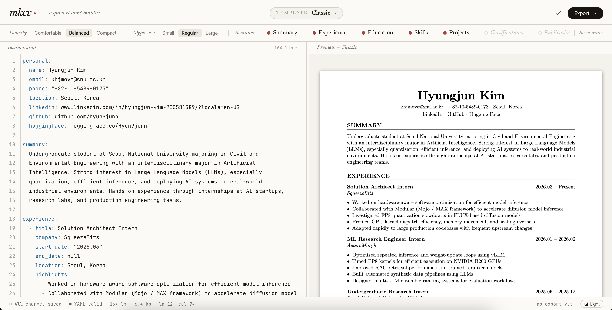

# mkcv

A web app for authoring and exporting your CV from a single YAML source of truth.

Write your CV once in YAML — get a live PDF preview, and export to Markdown, LaTeX, or PDF with one click, including mixed English/Korean resume content.



---

## What is mkcv?

mkcv is a browser-based CV editor. You write your resume in a simple YAML format on the left, and a polished PDF renders live on the right. When you're done, export to PDF, Markdown, or LaTeX — all from the same source. PDF rendering supports mixed English/Korean text, and each template can use its own Hangul font stack.

Everything is stored locally in your browser. No account needed, no data leaves your machine.

---

## Quick Start

### Option A — Hugging Face Space (no install)

Try it instantly in your browser — no Docker or Python needed:

**[https://huggingface.co/spaces/Hyun9junn/mkcv](https://huggingface.co/spaces/Hyun9junn/mkcv)**

### Option B — Docker (run locally)

> **Don't have Docker?** Install [Docker Desktop](https://www.docker.com/products/docker-desktop) first, then come back here.

```bash
docker pull ghcr.io/hyun9junn/mkcv:latest
docker run --rm -p 8000:8000 ghcr.io/hyun9junn/mkcv:latest
```

Open **http://localhost:8000** in your browser and start editing.

> **Note:** If you get a `pull access denied` error, the image may still be private. In that case, use the [local dev setup](#local-development) below.

---

## Features

| Feature | Details |
|---------|---------|
| **Live PDF preview** | PDF re-renders 1.5 s after you stop typing |
| **15 LaTeX templates** | Classic, ATS-friendly, finance, creative, technical, and more |
| **English + Korean PDF support** | Mixed English/Korean resume text renders through XeLaTeX with template-specific Hangul fonts |
| **Zoom controls** | Zoom 25%–400% via buttons or `Ctrl`/`⌘` + scroll wheel |
| **Section panel** | Drag chips to reorder sections, toggle visibility, reset to scaffold |
| **Layout controls** | Density (comfortable / balanced / compact) and font scale (small / normal / large) |
| **Contact field toggles** | Show or hide individual contact fields (email, phone, LinkedIn, etc.) per template |
| **Three export formats** | PDF (`.pdf`), Markdown (`.md`), LaTeX (`.tex`) |
| **YAML backup & restore** | Export your YAML and settings as a compressed archive; import on any machine |
| **Auto-save** | Resume and settings auto-save to browser localStorage as you type |
| **Inline YAML validation** | Errors shown in real time with field autocomplete hints |
| **Custom sections** | Add freeform sections beyond the built-in ones |
| **Dark / light mode** | Theme toggle persisted across sessions |

---

## Using the App

### Writing your CV

Type your CV in YAML in the left pane. The structure is straightforward — see [CV Format](#cv-format) for the full schema and an example.

- Changes auto-save as you type (no Save button needed)
- Validation errors appear inline — fix them and the preview updates
- Start typing a field name and autocomplete suggestions appear

### PDF Preview

The right pane shows a live PDF compiled from your YAML.

- **Zoom:** `+` / `−` buttons, click the percentage to reset to 100%, or `Ctrl`/`⌘` + scroll
- The preview refreshes 1.5 s after you stop typing

### Section Panel

The chip rail below the toolbar lists every section in your CV.

| Action | How |
|--------|-----|
| Show / hide a section | Click the chip — hides it in the PDF without touching your YAML |
| Reorder sections | Drag a chip left or right |
| Reset to scaffold | Click ↺ on the chip → confirm → you have 5 s to undo |
| Grey chips | Sections not yet in your YAML — drag them to reserve their position |

### Templates

Pick a template from the dropdown in the toolbar. Each template has its own defaults for layout, fonts, and section title styling.

Click **✓ Validate Template** to run a two-stage check (Jinja2 render + `xelatex` compile). Invalid templates show a ⚠ badge.

**Available templates:**

| Template | Style |
|----------|-------|
| `classic` | General-purpose default — clean serif, no color, low visual risk |
| `ats-signal` | ATS-first tech resume — single-column, bold section rules, clean parsing |
| `boardroom` | Consulting and finance — burgundy serif authority, compressed executive impact |
| `chancellor` | Conservative formal — red section rules, classic serif for traditional industries |
| `dealbook` | Finance-sector deals — structured for high-stakes corporate roles |
| `foundry` | Industrial modern — strong grid, high contrast |
| `letterpress` | Print-inspired — typographic craft, editorial feel |
| `masthead` | Newspaper-style header — bold byline layout |
| `mono-forge` | Monospaced technical — built for developers and engineers |
| `scholar-index` | Academic index — structured for research and publications |
| `signature-split` | Split-column signature — name and contact in a distinct header block |
| `skillboard` | Skills-forward — prominent skill display for technical roles |
| `slate-rail` | Dark accent rail — sidebar stripe with clean content area |
| `studio-pop` | Creative and bold — designed for design and creative industries |
| `trackline` | Timeline-style — experience laid out along a visual track |

### Layout Controls

Two knobs in the toolbar affect the PDF output:

- **Density** — `comfortable` (more whitespace), `balanced` (default), `compact` (more content per page)
- **Font scale** — `small`, `normal` (default), `large`

### Contact Field Toggles

Control which personal fields appear in the PDF header — useful when a specific template or job application doesn't need every contact detail. Toggle individual fields (email, phone, LinkedIn, GitHub, website, etc.) without editing your YAML.

### Settings Tab

Switch to the **Settings** tab to edit layout preferences and section order as YAML directly. Settings auto-save alongside your resume content.

### Backup & Restore

Use the **Export** menu to download your YAML and settings as a compressed archive. To restore on another machine, import the archive — your resume and all preferences reload exactly as you left them.

---

## CV Format

All sections except `personal` are optional. Empty sections are automatically skipped in every output format.

```yaml
personal:
  name: Your Name
  email: you@example.com
  phone: "+1-000-000-0000"
  location: City, Country
  linkedin: linkedin.com/in/yourhandle
  github: github.com/yourusername
  website: yoursite.com
  huggingface: huggingface.co/yourusername
  twitter: twitter.com/yourhandle
  photo: path/to/photo.jpg   # some templates support a photo

summary: >
  A short professional summary about yourself.

experience:
  - title: Software Engineer
    company: Acme Corp
    start_date: "2021"
    end_date: null            # null = Present
    location: Seoul, Korea    # optional
    highlights:
      - Built X, reducing latency by 40%
      - Led a team of 5 engineers

education:
  - degree: B.S. Computer Science
    institution: University Name
    year: "2020"              # or use start_date / end_date
    gpa: "3.9"                # optional
    courses: [Algorithms, Systems]  # optional
    thesis: "My thesis title"       # optional

skills:
  - category: Languages
    items: [Python, Go, TypeScript]
  - category: Tools
    items: [Docker, Kubernetes, PostgreSQL]

projects:
  - name: my-project
    description: What it does
    url: github.com/you/my-project
    date: "2023"
    tech_stack: [Python, FastAPI]
    highlights:
      - 500+ GitHub stars

certifications:
  - name: AWS Solutions Architect
    issuer: Amazon Web Services
    date: "2023"

publications:
  - title: "My Paper Title"
    venue: Conference Name / Journal
    date: "2023"
    url: link.to/paper
    authors: [Author One, Author Two]
    doi: "10.1234/example"

languages:
  - language: English
    proficiency: Native
  - language: Korean
    proficiency: Fluent

awards:
  - name: 1st Place, Some Competition
    issuer: Organizing Body
    date: "2024"
    description: Optional context

extracurricular:
  - title: Chess Club President
    organization: University Name
    date: "2023"
    highlights:
      - Won regional championship

custom_sections:
  - title: Volunteering
    entries:
      - heading: Mentor
        subheading: Code for Good
        date: "2024"
        highlights:
          - Mentored 10 junior developers
```

### Supported Sections

| Key | What it contains |
|-----|-----------------|
| `personal` | Name, contact info, links, photo |
| `summary` | Professional summary (free text) |
| `experience` | Work history |
| `education` | Degrees and institutions |
| `skills` | Grouped skill lists |
| `projects` | Personal or professional projects |
| `certifications` | Professional certifications |
| `publications` | Papers, articles, blog posts |
| `languages` | Spoken languages |
| `awards` | Prizes and recognitions |
| `extracurricular` | Activities outside work |
| `custom_sections` | Any freeform sections you define |

---

## Your Data

mkcv stores everything in your browser's localStorage. The server is stateless — it processes requests and returns files, but stores nothing.

| Key | Content |
|-----|---------|
| `mkcv:default:resume.yaml` | Your CV content |
| `mkcv:default:settings.yaml` | Layout, section order, template preferences |

Data persists across sessions on the same machine and browser. **If you clear your browser's site data, your resume is gone unless you exported a backup first.**

---

## Local Development

For development without Docker. Requires Python 3.11+ and `xelatex` on your `PATH`.

```bash
git clone https://github.com/hyun9junn/mkcv.git
cd mkcv
python -m venv .venv
source .venv/bin/activate      # Windows: .venv\Scripts\activate
pip install -r requirements.txt
uvicorn backend.main:app --reload
```

Open **http://localhost:8000**.

> The Docker image bundles TeX Live, XeLaTeX, and Korean fonts, so PDF generation works out of the box. For local dev, install LaTeX separately — see [Installing LaTeX](#installing-latex).

### Running Tests

```bash
pytest -v
```

---

## Cloud Deployment

mkcv is a stateless container — deploy anywhere Docker runs. No platform-specific config files needed; both platforms below auto-detect the `Dockerfile`.

### Railway

1. Fork this repo and connect it to a new Railway project via **Deploy from GitHub repo**
2. Railway sets `PORT` automatically
3. Optionally set `WEB_CONCURRENCY=4` for higher PDF throughput under load

### Render

1. Create a new **Web Service** → connect your GitHub repo
2. Set environment to **Docker**
3. Render sets `PORT` automatically — no additional config needed

---

## Installing LaTeX

Required for local dev only. Docker users can skip this.

mkcv uses `xelatex` for PDF generation. For Korean text support, make sure your local setup includes both XeLaTeX and Korean fonts such as Nanum or Noto CJK.

### macOS

**MacTeX (full, ~4 GB):**
```bash
brew install --cask mactex
```
Open a new terminal after installation.

**BasicTeX (minimal, ~100 MB) + required packages:**
```bash
brew install --cask basictex
# open a new terminal, then:
sudo tlmgr update --self
sudo tlmgr install xetex collection-langkorean collection-fontsrecommended enumitem geometry hyperref xcolor fontawesome5
```

If Korean text still falls back to generic fonts, install Nanum or Noto CJK fonts at the OS level.

### Windows

**MiKTeX (recommended — auto-installs missing packages):**
1. Download the installer from https://miktex.org/download
2. Run the installer (install for all users recommended)
3. Open a new Command Prompt — `xelatex` is on `PATH` automatically
4. Keep on-the-fly package installation enabled, and install Nanum or Noto CJK fonts in Windows if Korean font lookup fails

**TeX Live:**
1. Download `install-tl-windows.exe` from https://tug.org/texlive/acquire-netinstall.html
2. Run the installer
3. Ensure XeTeX and Korean language/font support are included

### Linux

```bash
# Debian / Ubuntu
sudo apt-get install texlive-latex-recommended texlive-fonts-recommended \
     texlive-latex-extra texlive-fonts-extra texlive-lang-korean \
     texlive-xetex fonts-nanum fonts-noto-cjk

# Fedora / RHEL
sudo dnf install texlive-scheme-medium texlive-xetex google-noto-cjk-fonts

# Arch Linux
sudo pacman -S texlive-most noto-fonts-cjk
```

**Verify:**
```bash
xelatex --version
```

---

## Adding a Custom Template

1. Create `backend/templates/<your-name>/cv.tex.j2`
2. Optionally create `backend/templates/<your-name>/meta.yaml` to set display name, default layout, section title casing, and template-specific Hangul font stacks
3. Use these Jinja2 delimiters (chosen to avoid conflicts with LaTeX `{}`):
   - Variables: `<< variable >>`
   - Blocks: `<% if condition %>` / `<% endif %>`
   - Comments: `<# comment #>`
4. Include `<< xelatex_preamble >>` somewhere in the LaTeX preamble so shared XeLaTeX and Korean font support is enabled
5. CV data is available as `cv` — see `backend/models.py` for the full schema
6. Restart the server — the template appears in the dropdown automatically
7. Click **✓ Validate Template** to confirm it compiles

See `backend/templates/classic/cv.tex.j2` for a reference implementation.

---

## API Reference

| Endpoint | Method | Body | Response |
|----------|--------|------|----------|
| `/api/validate` | POST | `{yaml, template}` | `{valid, errors[]}` |
| `/api/preview` | POST | `{yaml, template}` | `{markdown}` |
| `/api/preview/pdf` | POST | `{yaml, template, section_order, density, font_scale}` | PDF bytes |
| `/api/export/markdown` | POST | `{yaml, template}` | `.md` file |
| `/api/export/latex` | POST | `{yaml, template}` | `.tex` file |
| `/api/export/pdf` | POST | `{yaml, template}` | `.pdf` file |
| `/api/templates` | GET | — | `{templates[], validation{}}` |
| `/api/templates/{name}/validate` | POST | — | `{valid, errors[]}` |
| `/api/schema` | GET | — | CV JSON schema |

All error responses share a common shape:
```json
{
  "error": "invalid_yaml | validation_error | unknown_template | pdf_generation_failed",
  "message": "Human-readable description",
  "details": ["..."]
}
```

---

## Tech Stack

- **Backend:** FastAPI, Pydantic v2, PyYAML, Jinja2
- **Frontend:** Vanilla JS, CodeMirror 5, js-yaml, PDF.js, JSZip
- **PDF:** xelatex (TeX Live / MiKTeX) with template-specific Hangul font stacks
- **Tests:** pytest, pytest-asyncio, httpx
